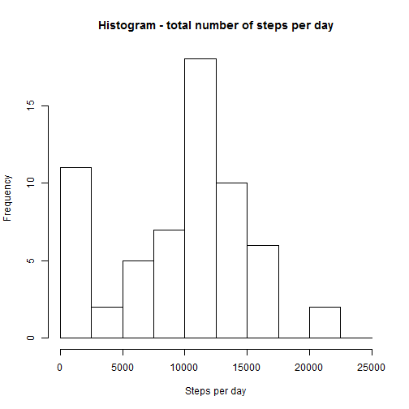
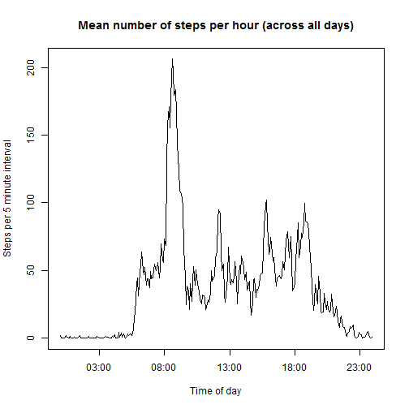
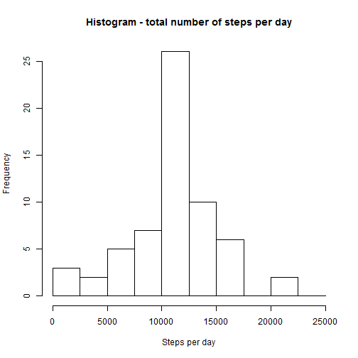
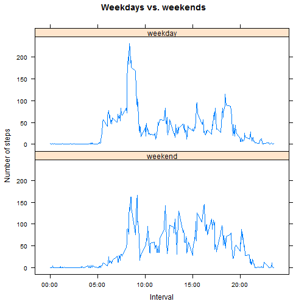

load---
title: "Reproducible Research: Peer Assessment 1"
output: 
  html_document:
    keep_md: true
---


## Loading and preprocessing the data

```r
#load libraries
library(plyr)
library(stringr)
library(lubridate)
library(lattice)
# read the data
activity<-read.csv("activity.csv")
# create data structure with total number of steps per day
meanActivity_byDate<-ddply(activity,.(date),summarize,steps=sum(steps,na.rm = T))
# create data structure with mean (across all days) number of steps per interval
meanActivity_byInterval<-ddply(activity,.(interval),summarize,steps=mean(steps,na.rm = T))
# add a 'timeline' column for plotting purposes
meanActivity_byInterval$timeline<- meanActivity_byInterval$interval %>% str_pad(4,pad=0) %>%  as.character() %>% strptime("%H%M")
```

## What is mean total number of steps taken per day?
* Histogram of the total number of steps per day:  

```r
hist(meanActivity_byDate$steps,breaks=seq(0,25000,2500),
        main="Histogram - total number of steps per day",xlab="Steps per day")
```



* Mean value of steps per day:

```r
mean(meanActivity_byDate$steps,na.rm = T)
```

```
## [1] 9354.23
```
* Median value of steps per day:

```r
median(meanActivity_byDate$steps,na.rm = T)
```

```
## [1] 10395
```

## What is the average daily activity pattern?
* Plot showing the mean (across all days) number of steps for each time interval of the day:

```r
with(meanActivity_byInterval,plot(timeline,steps,type="n",xlab="",ylab="")) # create empty 'canvas'
with(meanActivity_byInterval,lines(timeline,steps,type="l")) # add lines
title(main="Mean number of steps per hour (across all days)",xlab="Time of day",ylab="Steps per 5 minute interval")
```



* Time interval with maximal mean number of steps:

```r
# find index of interval with maximal steps
maxIndex=which.max(meanActivity_byInterval$steps)
# print a detailed description of the time requested
paste(meanActivity_byInterval$timeline[maxIndex] %>% format("%H:%M"),meanActivity_byInterval$timeline[maxIndex+1] %>% format("%H:%M"), sep=" to ")
```

```
## [1] "08:35 to 08:40"
```
## Imputing missing values
* Number of missing values:

```r
sum(is.na(activity$steps))
```

```
## [1] 2304
```
* Impute missing values by setting to be the mean for their interval

```r
# define the indices of missing values
naIndex<-which(is.na(activity$steps))
# create a copy of 'activity'
full_activity<-activity
# go over all missing vlues. for each, find the mean value for the corresponding interval
for (ind_ in naIndex){
        interval_<-full_activity$interval[ind_]
        full_activity$steps[ind_]<-
        meanActivity_byInterval$steps[meanActivity_byInterval$interval==interval_]
}
```
* Histogram, mean and median values of filled database:

```r
# prepare new data by day
full_meanActivity_byDate<-ddply(full_activity,.(date),summarize,steps=sum(steps,na.rm = T))
# histogram
hist(full_meanActivity_byDate$steps,breaks=seq(0,25000,2500),
        main="Histogram - total number of steps per day",xlab="Steps per day")
```




```r
mean(full_meanActivity_byDate$steps,na.rm = T)
```

```
## [1] 10766.19
```


```r
median(full_meanActivity_byDate$steps,na.rm = T)
```

```
## [1] 10766.19
```

**By comparing the two histograms, and examining the differences, we can see the imputing process had the following effects:**  
1. The frequency for low-step-value days was dimished in exchange for a growth in the number of days with the mean value.  
2. The mean and median are now exactly equal. This suggests that the data is now more evenly spread aroung the mean value, but is also a side effect of the large amount of mean-valued days due to the method chosen for imputing

## Are there differences in activity patterns between weekdays and weekends?  
* Diffrentiate weekdays from weekends:  

```r
# define weekend
weekend<-c("Saturday","Sunday")
# create new factor with labels 'weekday'\'weekend'
full_activity$daytype<-factor(weekdays(ymd(full_activity$date)) %in% weekend,levels=c(T,F),labels=c("weekend","weekday"))
```
* Plot showing the mean (across all days of same type) number of steps for each time interval of the day, for weekdays orand for weekends seperately:

```r
# prepare the data
meanActivity_byInterval_perDaytype<-ddply(full_activity,.(interval,daytype),summarize,steps=mean(steps,na.rm = T))
# add a 'timeline' column for plotting purposes
meanActivity_byInterval_perDaytype$timeline<- meanActivity_byInterval_perDaytype$interval %>% str_pad(4,pad=0) %>%  as.character() %>% strptime("%H%M")
# plot
xyplot(steps~interval|daytype,meanActivity_byInterval_perDaytype,
        layout=c(1,2),type="l",
        scales=list(
                alternating=FALSE,
                x=list(
                at=seq(0,2000,500),labels=c("00:00","05:00","10:00","15:00","20:00"))),
                main="Weekdays vs. weekends",xlab="Interval",ylab="Number of steps")
```



**Interesting points reached by observing the plot:**  
1. Activity on the weekend tends to start a little later and slower than durring the weekdays.  
2. Maximum number of steps per interval is haigher durring the weekdays.  
3. The activity over the weekend is more evenly distributed along the day. For instance, there are more intervals when the number of steps is higher than 100.
